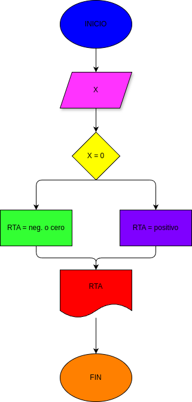

# ejercicio 1
- programa para determinar si un numero es positivo o negativo 

## diagrama de flujo

## función

- mediantes un programa de python determinamos con procesos matematicos como un numero es positivo y negativo