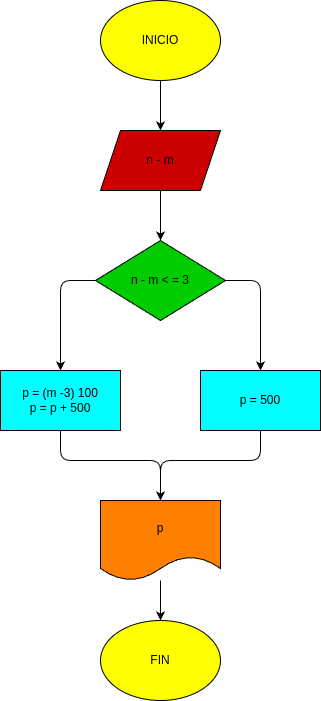

# Ejercicio #2

- programa para determinar el costo de una llamada 

## diagrama de flujo

# proceso

- programa de python para determinar el valor de una llamada mediante el tirmpo limite, una ves pas el tiempo se cobraran 100 pesos luego de los 3 minutos de hablar 