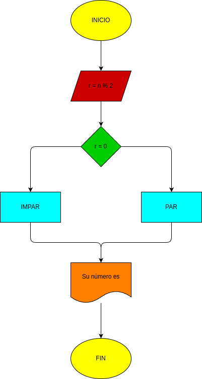

# Ejercicio #3
- programa de python para saber si un número de es par o impar

# diagrama de flujo

## proceso
 - introducir un número par o impar y que elprograma mediante operaciones matematicas sepa diferencia entre par e impar 