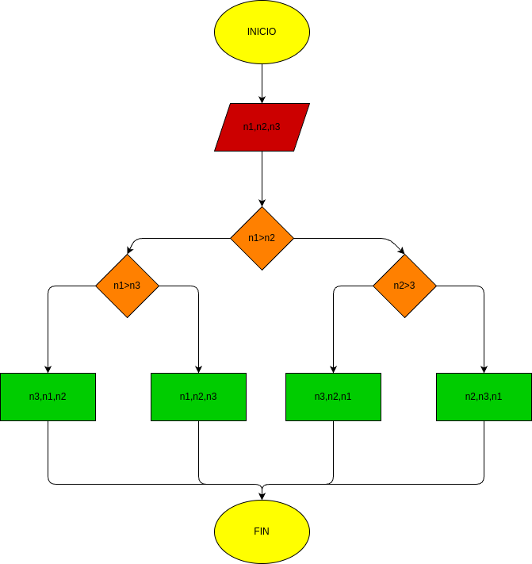

##  Ejercicio #5 
- programa de python para escoger el número mayor entre tres que se insertan

## diagrama de flujo 

## Procesos

- con secuencia de ecuaciones y operaciones se logra saber cual es el número mas grande de un conjunto de tres números dados por el receptor (la persona que manipula la computadora) y el sistema detecta cual es el mas grande 